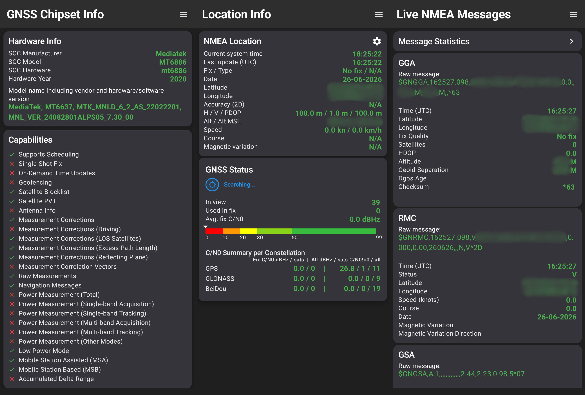
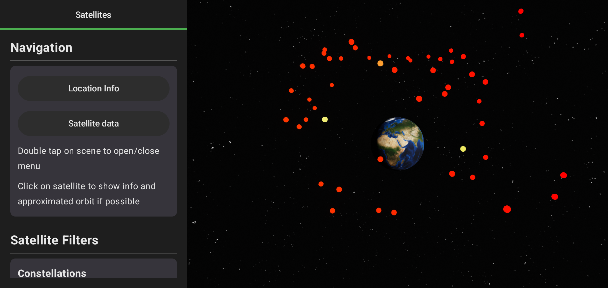
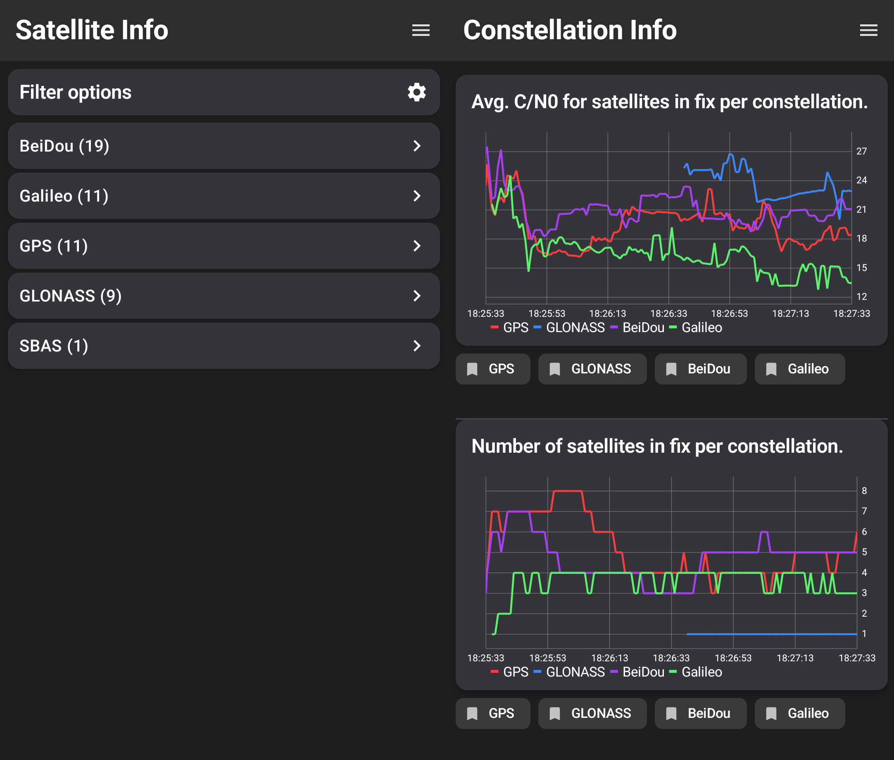

# GNSSMap

> **Note:** This project was originally developed under the name **GNSSSatelliteViewer**.

## Description

**GNSSMap** is a Android application for real-time GNSS satellite tracking and visualization. It provides an interactive 3D representation of the Earth, allowing users to observe satellite positions, analyze constellation geometry and monitor signal quality.
Designed with an offline-first approach, the application processes GNSS data locally without need for internet connection, making it suitable for fieldwork, research and educational purposes.

---

## Motivation

There are a lot of GPS/GNSS tracking apps that will display information about location and signal quality. However there were no apps that shows the satellite position in 3D space without the use of internet. 

GNSSMap was created to fill this gap, aiming to eliminate cloud dependencies and provide real-time orbital visualization directly on the screen. Built for autonomy, it transforms raw satellite data into 3D environment processed entirely on-device.

---

## Features

* Real-time GNSS satellite tracking
* Interactive 3D celestial sphere visualization
* Live satellite signal strength monitoring
* Signal quality charts and diagnostics
* Support for multiple GNSS constellations (depending on device capabilities)
* Fully offline operation
* High-performance rendering powered by Filament
* Intuitive touch controls for navigation

---

## Technologies Used

* Kotlin
* Android SDK
* SceneView
* Google Filament
* Jetpack Components
* MPAndroidChart
* Android GNSS APIs

---

# Quick Start

## Prerequisites

* Android Studio (latest stable version recommended)
* Android SDK (API Level 30 or higher)
* Gradle
* Android device with GNSS/GPS hardware

## Installation

1. Clone the repository:
```bash
git clone https://github.com/yourusername/GNSSMap.git
```
2. Open the project in Android Studio.
3. Sync and Build.
4. Run the application on a physical Android device with GNSS capabilities.

**OR**

Someday on ```Play Store``` 

---

# Usage

The application will ask for location permisions - it is necerasy to work.

## Navigation between views
* Use *Menu* icon (top right corner) to change views

## Main Screen (Location info)
* You can change information source by clicking *Gear* icon in *NMEA Location* Panel 
* Swipe *left* to see Live NMEA Messages and their statistics
* Swipe *right* to see the information about device GNSS chipset  




## Satellite 3D View 
* Drag to move the camera
* Pinch to zoom
* Doubble click to toggle Menu
* Click on a satellite or Earth to show details
* Use Left-side menu to move between the Main views or filter the satellites 
 



## Satellite Info 
* Click on *Filter options* panel to open Filter options and chose:
    * Show only satellites used in fix
    * Select satellites from constellations (default is all)
    * Select specific satellite
    * Reset button will uncheck all selections
* Swipe *Left* to see Constellation Info
    * Select *Bookmark* icon to toggle constellation on graph 
  



# License

This project is licensed under the MIT License. See the `LICENSE` file for more information.


# Acknowledgements

Special thanks to the developers and maintainers of:

* SceneView
* Google Filament
* MPAndroidChart
* Android Open Source Project (AOSP)
